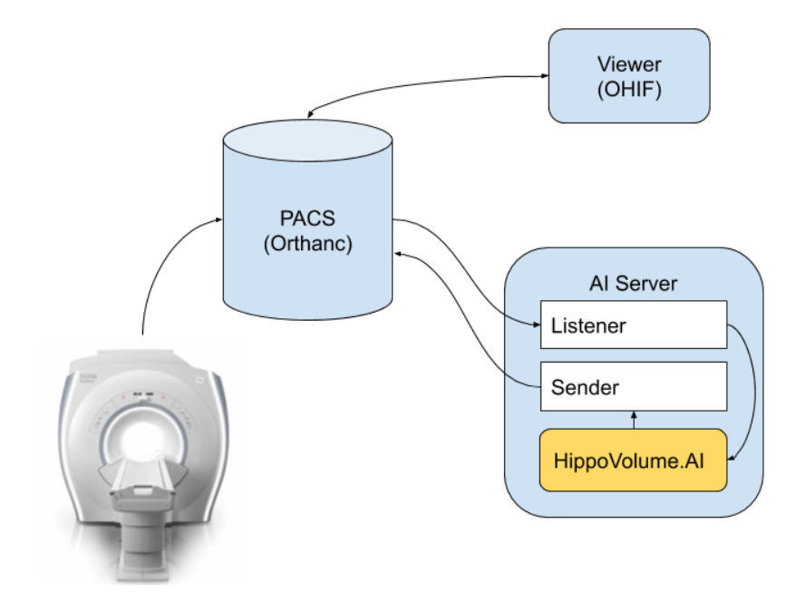
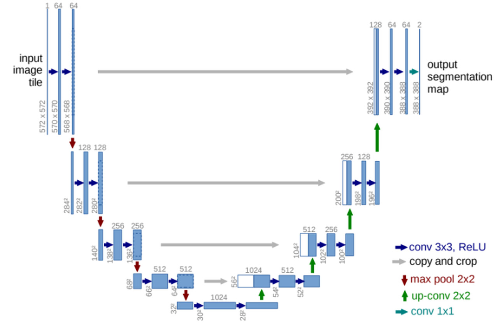
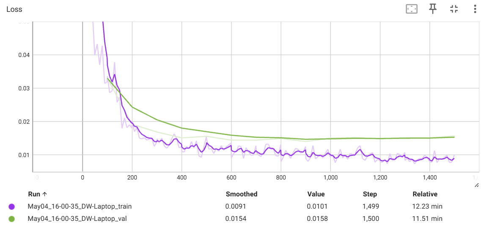

## 🎯 Objective
Develop an AI-powered segmentation model that segments the right hippocampus from cropped MRI volumes and computes its volume. This measurement contributes vital information for monitoring Alzheimer's disease progression, supporting clinicians in decision-making and therapy management.

## 🧠 Project Overview
This project was completed as part of the **Udacity AI in Healthcare Nanodegree Program**. This project unfolds in two main parts. The first focuses on building a robust segmentation model using a U-Net architecture to delineate the hippocampus from T2-weighted MRI images. The second part emphasizes integrating this model into a clinical workflow. In this phase, the model was deployed into a simulated clinical network environment that mimics real hospital settings. This environment includes:
- **MRI Scanner Simulation:** A script [send_volume.sh](section3/out/Code/deploy_scripts/send_volume.sh) that simulates a radiological exam by sending imaging studies to the clinical PACS.
- **PACS Server (Orthanc):** Configured to listen for DICOM requests and expose a DicomWeb interface, storing studies and auto-routing images to the AI server.
- **Viewer System (OHIF):** Providing a web-based interface (running on port 3000) for clinicians to review imaging studies and AI-generated reports.
- **AI Server Integration:** Utilizing scripts such as [start_listener.sh](section3/out/Code/deploy_scripts/start_listener.sh)  and [inference_dcm.py](section3/out/Code/inference_dcm.py) to capture the studies, execute the segmentation model, compute hippocampal volumes, and send back the generated report to the PACS. This integration into a simplified workspace (with no GPU) mirrors typical clinical environments and highlights practical deployment challenges and solutions.

**Clinical Flowchart:**  

## Clinical significance of Quantifying Alzheimer's Disease Progression Through Automated Measurement of Hippocampal Volume
Alzheimer's disease (AD) is a progressive neurodegenerative disorder that results in impaired neuronal (brain cell) function and eventually, cell death. AD is the most common cause of dementia. Clinically, it is characterized by memory loss, inability to learn new material, loss of language function, and other manifestations. 

For patients exhibiting early symptoms, quantifying disease progression over time can help direct therapy and disease management. 

A radiological study via MRI exam is currently one of the most advanced methods to quantify the disease. In particular, the measurement of hippocampal volume has proven useful to diagnose and track progression in several brain disorders, most notably in AD. Studies have shown reduced volume of the hippocampus in patients with AD.

The hippocampus is a critical structure of the human brain (and the brain of other vertebrates) that plays important roles in the consolidation of information from short-term memory to long-term memory. In other words, the hippocampus is thought to be responsible for memory and learning (that's why we are all here, after all!)

Humans have two hippocampi, one in each hemisphere of the brain. They are located in the medial temporal lobe of the brain. Fun fact - the word "hippocampus" is roughly translated from Greek as "horselike" because of the similarity to a seahorse, a peculiarity observed by one of the first anatomists to illustrate the structure.

According to [studies](https://www.sciencedirect.com/science/article/pii/S2213158219302542), the volume of the hippocampus varies in a population, depending on various parameters, within certain boundaries, and it is possible to identify a "normal" range when taking into account age, sex and brain hemisphere. 

There is one problem with measuring the volume of the hippocampus using MRI scans, though - namely, the process tends to be quite tedious since every slice of the 3D volume needs to be analyzed, and the shape of the structure needs to be traced. The fact that the hippocampus has a non-uniform shape only makes it more challenging. 

## 📦 About the Dataset
The dataset originates from the Medical Decathlon competition and consists of:
- Cropped T2 MRI scans focusing on the area around the hippocampus,
- Corresponding segmentation masks for the right hippocampus stored in NIFTI format.

The segmentation masks contain three distinct labels.

 - **Background : 0**
 - **Hippocampal Anterior : 1**
 - **Hippocampal Posterior : 2**

Using these cropped volumes simplifies the training regime by reducing computational load and focusing on the region of interest, making it suitable for both model development and practical deployment in a representative clinical environment.

## Project Steps

### 1. Exploratory Data Analysis 

## Overview
In this notebook, an in-depth analysis of the hippocampus MRI scans and their corresponding segmentation masks (in NIFTI format) was performed. Goal here was to understand the data structure, visualize key anatomical features, extract relevant metadata, quantify hippocampal volumes, and identify outliers to create a clean dataset for subsequent machine learning tasks.

## Data Inspection and Visualization
- **Visualization of Anatomical Slices:**  
  Using Matplotlib, multiple slices of the volumetric data were visualized:
  - **Axial Slices:** Overlaid the segmentation mask on grayscale images to clearly delineate the hippocampus.
  - **Coronal Slices:** Provided another perspective to inspect the structure across different orientations.
  - **Sagittal Slices:** Allowed us to verify the consistency of the segmentation across another anatomical plane.
  
  In addition, a Maximum Intensity Projection (MIP) was computed to provide a comprehensive view of the intensity distribution, enhancing our understanding of the overall volume.

## Metadata Exploration and Volume Computation
- **Header Analysis:**  
  The NIFTI header was examined to confirm the file format, bits per pixel, and the units of measurement. Extracted voxel dimensions (from the `pixdim` field) were found to be regular (e.g., 1.0 mm spacing in each direction).

- **Physical Volume Calculation:**  
  With the voxel dimensions known, the physical volume per voxel (in mm³) was computed. By summing all the labeled (segmented) voxels and multiplying by the voxel volume, the raw hippocampal volume was obtained. The calculated volumes were within the typical range (~2200 to ~4500 mm³), confirming the physiological plausibility.

## Histogram Analysis and Outlier Detection
- **Volume Distribution:**  
  A histogram was plotted to visualize how hippocampal volumes were distributed across the dataset. This graph enabled us to quickly spot outliers – volumes that exceeded a set threshold (e.g., above 5000 mm³).

- **Dataset Cleaning:**  
  Based on this analysis, files with outlier volumes were flagged, and discrepancies (e.g., mismatched file pairs or incorrect dimensions) were identified. These files were then discarded to ensure that the training dataset only contained clean, consistent volumes.

### 2. Model Training

## 📁 Training and Validating Datasets

- **Loader Script**: [HippocampusDatasetLoader.py](section2/out/src/data_prep/HippocampusDatasetLoader.py)
- **Function**: `LoadHippocampusData(...)`
  - Loads MRI images and labels from NIfTI files using `medpy.io.load`.
  - Normalizes image intensities to [0, 1].
  - Reshapes images to `[AXIAL_WIDTH, 64, 64]` using `med_reshape`.
  - Returns list of dictionaries with keys: `image`, `seg`, `filename`.

- **Dataset Split**:
  - 70% Training
  - 20% Validation
  - 10% Testing
  - Performed via shuffled indices in [run_ml_pipeline.py](section2/out/src/run_ml_pipeline.py)

---

## 🧠 Model Architecture

- **Model**: Recursive 2D U-Net
- **Location**: [RecursiveUNet.py](section2/out/src/networks/RecursiveUNet.py)
- **Features**:
  - Downsampling with MaxPooling
  - Upsampling with ConvTranspose2D
  - Skip connections between encoder and decoder
  - Instance normalization and LeakyReLU activations
  - Final `Conv2d` to 3 output classes (background, anterior, posterior)

---

## 🖼️ Image Pre-Processing

- Normalized images to [0, 1]
- Reshaped to fixed patch size `[*, 64, 64]`
- Labels cast to integer format (required for `CrossEntropyLoss`)
- No augmentation used (can be added later with PyTorch `transforms`)

---

## 🛠️ Training Pipeline

- **Script**: [UNetExperiment.py](section2/out/src/experiments/UNetExperiment.py)

### ⚙️ Core Components

- **Loss**: `CrossEntropyLoss`
- **Optimizer**: `Adam`
- **Learning Rate Scheduler**: `ReduceLROnPlateau`
- **Batch Size**: 64
- **Epochs**: 15

### 🔁 Training Loop
- Loads 2D slices: `[B, 1, 64, 64]`
- Performs forward pass
- Calculates loss
- Backpropagates and updates model weights
- Logs:
  - Input images
  - Masks
  - Probability maps
  - Predictions to TensorBoard

### 📉 Validation Loop
- No gradients computed
- Evaluates average loss across validation set
- Logged to TensorBoard

---

## 🧪 Performance Assessment on test data

- **Mean Dice:** 0.9 
- **Mean Jaccard:** 0.82

### 📁 Outputs

- Evaluation metrics saved to: [results.json](section2/out/results.json)
- Model weights saved to: model.pth`

---

## 📂 File Structure Summary

| File | Purpose |
|------|---------|
| `run_ml_pipeline.py` | Launches training and testing |
| `UNetExperiment.py` | Training, validation, and testing logic |
| `RecursiveUNet.py` | Recursive U-Net architecture |
| `UNetInferenceAgent.py` | Inference on 3D volumes |
| `volume_stats.py` | Dice, Jaccard, Sensitivity, Specificity calculations |
| `HippocampusDatasetLoader.py` | Loads, normalizes, reshapes MRI data |
| `utils.py` | TensorBoard logging, reshaping, plotting |

---

# FDA Validation Plan**

An FDA Validation Plan and supporting documentation have been prepared separately and are available in the [`FDA_HippocampalAI_ValidationPlan.pdf`](section3/out/FDA_HippocampalAI_ValidationPlan.pdf) file.